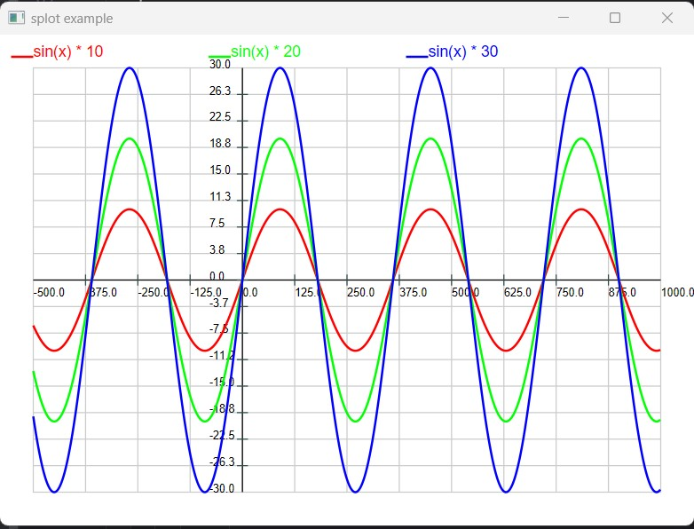

# Splot



Simple Plotter (Splot)
------
This is simple plotter implement for C++.
This is a very simple plotter module, providing a drawing interface and a low-level rendering interface.
It can be easily ported to various UI platforms by implement the render API.

```asm
irender.h  an An abstract API of render,please implement a render.
isploter.h  the abstract interface of sploter
sploter_data.h the interface of curves data.
```

## Usage

1. implement the `irender` API
2. init `std::unique_ptr<isploter> plot_` with a `std::make_unique<sploter>(sploter())` pointer instance.
2. call ` plot_->draw(render_->init(&ctx));` in the UI `draw(ctx)` function.
3. call `handle_events` and `mouse_click`.
4. run and show the UI!
```c++

  bool eplot::cursor(context const &ctx, point p, cursor_tracking status)
  {
   return  plot_->handle_events(render_->init(&ctx), p.x, p.y, static_cast<isploter::cursor_tracking>(status));
  }

  bool eplot::click(const context &ctx, mouse_button btn)
  {
    tracker<>::click(ctx, btn);
    return plot_->mouse_click(
        render_->init(&ctx), btn.pos.x, btn.pos.y, btn.down, static_cast<isploter::mouse_key>(btn.state));
  }
```

add link to splot library in cmake
```asm
target_link_libraries(splot_example splot::splot)
```


## Examples

There's an example for elements UI. 
Please check the `SPLOT_BUILD_EXAMPLES` option to be ON (default is ON).

### Steps to build

```
tree view
cpp
|__splot 
    |_...(this project folder)
|_elements
```

1. first download [elements](https://github.com/cycfi/elements) somewhere.
   ```bash
   git clone https://github.com/cycfi/elements 
    ```
2. set the `ELEMENTS_ROOT` value to the path elements. It's set to `examples/CMakeLists.txt`

```cmake
set(ELEMENTS_ROOT "${CMAKE_CURRENT_SOURCE_DIR}/../../elements")
```
3. build with cmake

## Know Behaviors 

- x,y axes may grid may NOT divided by 10, it's intend to auto fix the data ranges. 
Also try to make Zero(original XY) on the grid.
- axes may adjust to the data ranges